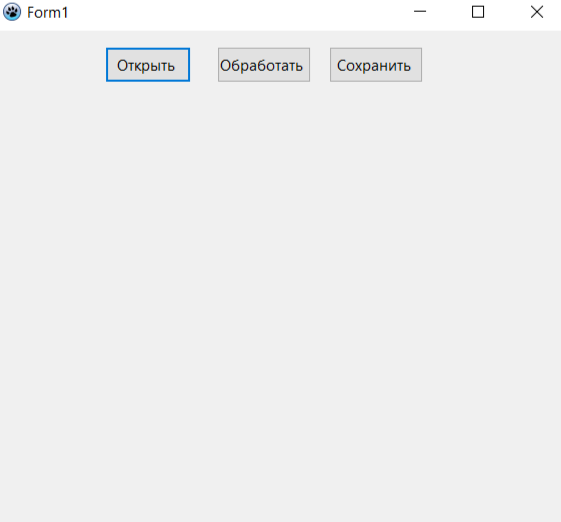
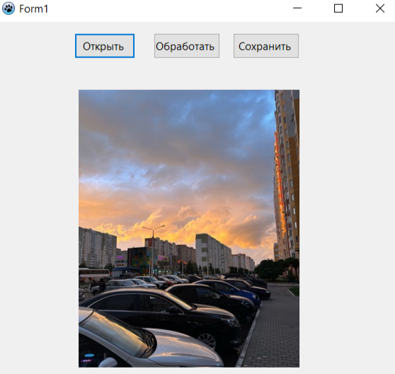
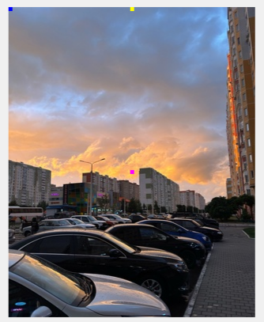
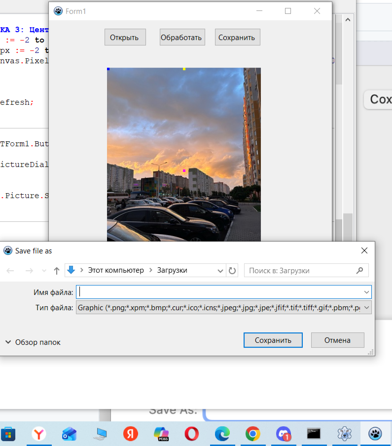

# Лабораторная работа №1 — Обработка растровых изображений

## Постановка задачи

Разработать приложение на Free Pascal (Lazarus) для базовой обработки растровых
изображений: загрузка фото из файла, добавление на изображение точек заданного
цвета в заданные координаты, сохранение результата на диск.

**Вариант 2.** Разместить на изображении три точки:

| № | Цвет (RGB) | Позиция |
|---|---|---|
| 1 | (0, 0, 255) — синий | левый верхний угол |
| 2 | (255, 255, 0) — жёлтый | центр верхней строки |
| 3 | (255, 0, 255) — пурпурный | центр изображения |

## Инструменты

- Free Pascal Compiler (FPC)
- Lazarus IDE
- Компоненты LCL: `TImage`, `TBitmap`, `Canvas`

## Решение

Код приложения находится в файле [`Unit1.pas`](Unit1.pas).

Логика работы:
- **Кнопка «Открыть»** — открывает диалог выбора файла и загружает изображение в `TImage`
- **Кнопка «Обработать»** — копирует изображение во временный 24-битный битмап (для корректной работы с пикселями независимо от исходного формата файла), затем рисует три точки заданного цвета в заданных координатах через `Canvas.Pixels`
- **Кнопка «Сохранить»** — сохраняет обработанное изображение в файл на диске

## Демонстрация работы

**1. Стартовое окно приложения**

**2. Загруженное изображение**

**3. Изображение с добавленными точками**

Синяя точка — левый верхний угол, жёлтая — центр верхней строки, пурпурная — центр изображения.

**4. Сохранение результата**

## Как запустить

1. Открыть `project1.lpi` в Lazarus IDE
2. Собрать проект (`F9`)
3. «Открыть» — выбрать изображение
4. «Обработать» — добавить точки
5. «Сохранить» — сохранить результат в файл

## Вывод

Изучены базовые средства Lazarus для работы с растровой графикой: чтение/запись
файлов изображений через `TPicture`, приведение изображения к формату `pf24bit`
через промежуточный `TBitmap`, прямой доступ к пикселям через `Canvas.Pixels`,
работа с координатной системой битмапа (`Width`, `Height`).
